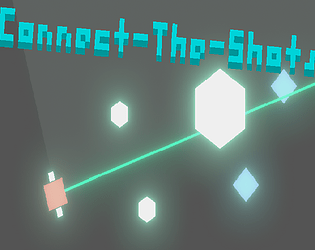

 

# Hi there, nice to see you! 

My name is __Tommy__, and I am currently a second year student studying Computer Science at the University of Waterloo. You can check out all my projects <a href='https://tommy-personal-website.netlify.app/'>here</a>!

 

## About me :smiley:

* I love coding and building projects :wrench:
* I enjoy watching anime :computer:
* I'm always craving for a delicious bowl of Phở! 

## Check out my projects!!

 &nbsp;

## Languages and Tools:

## Connect with me:

